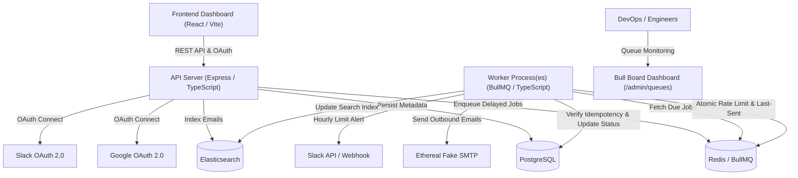
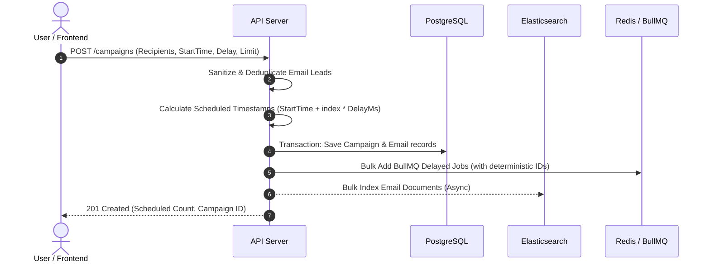
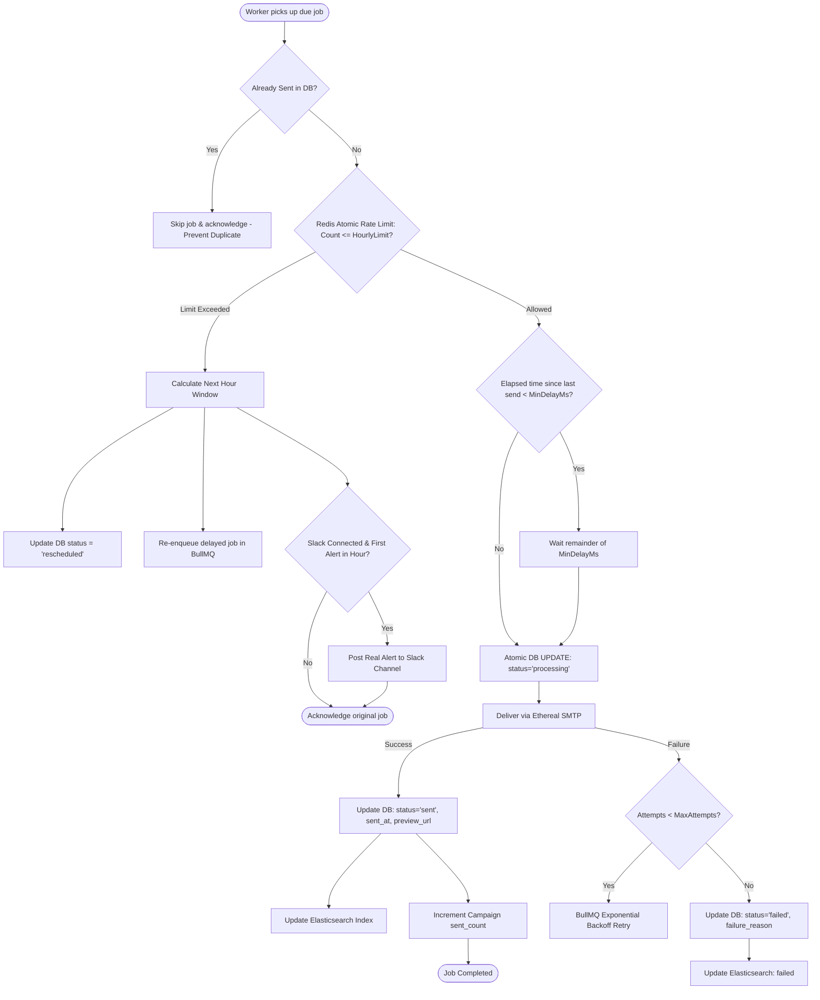
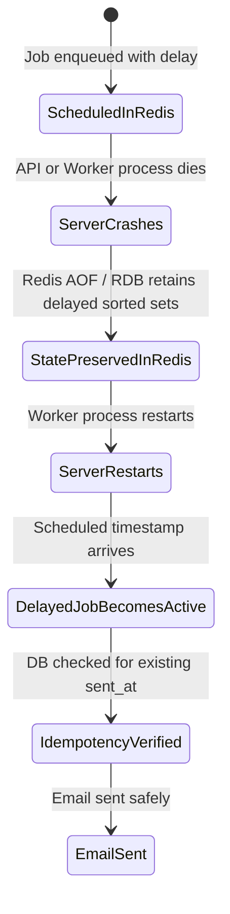

# ReachInbox Full-Stack Email Job Scheduler – Architecture Documentation

This document describes the high-level architecture, scheduling algorithms, distributed rate-limiting mechanisms, crash recovery, and external integrations of the ReachInbox Email Job Scheduler.

---

## 1. System Architecture Overview

The system is designed with a decoupled, asynchronous, and horizontally scalable architecture:



---

## 2. Core Scheduling & Throttling Flow

When a user schedules an email campaign:



---

## 3. Worker Execution, Rate Limiting & Idempotency Flow

Workers execute jobs with configurable concurrency and distributed safety:



---

## 4. Server Restart & Crash Resilience

Why jobs survive server restarts without loss or duplication:



1. **Persistent Delayed Jobs in Redis**: BullMQ stores delayed jobs in Redis sorted sets (`bull:reachinbox-email-queue:delayed`) keyed by the exact unix timestamp when they are due. When the worker or server crashes, Redis retains these keys.
2. **Deterministic Job IDs**: Every job is assigned an ID in the format `email:<uuid>`. If a worker attempts to register or re-queue the same email, BullMQ rejects duplicates.
3. **Database Idempotency Transitions**: Even if a network partition causes a worker to re-read a job, the worker executes an atomic SQL query:
   ```sql
   UPDATE emails SET status = 'processing', attempts = attempts + 1
   WHERE id = $1 AND status != 'sent' RETURNING *;
   ```
   If the email was already sent, this statement returns zero rows and the worker skips sending immediately.

---

## 5. Distributed Hourly Rate Limiting Design

- **Granular Keying**: Redis counter key is computed as `ratelimit:sender:{senderId}:{hourWindow}` where `hourWindow = Math.floor(Date.now() / 3600000)`.
- **Atomic Lua Script**:
  ```lua
  local current = redis.call('INCR', KEYS[1])
  if current == 1 then
    redis.call('EXPIRE', KEYS[1], 7200)
  end
  return current
  ```
- **Order Preservation**: When the limit is exceeded, jobs are rescheduled with a delay equal to `(nextHourWindow - now) + index * delayMs`, ensuring that original ordering is preserved into subsequent windows.
- **Slack Alert Throttling**: An atomic `SET notified:slack:{senderId}:{hourWindow} 1 EX 7200 NX` ensures only one alert is dispatched per sender per hour window.
